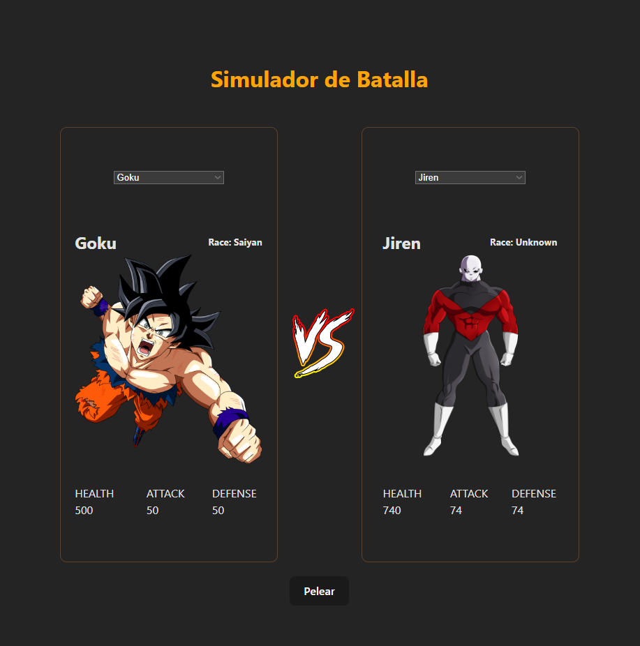

# Simulador de pelea DBZ

### Proyecto Integrador React. 

#### Trabajo final de curso "Desarrollador Web Frontend" por parte de la Universidad de Tres de Febrero ([UNTREF](https://untref.edu.ar/)).


## Proyecto en pantalla


Simulador de pelea con personajes de DBZ utilizando una  [API](https://back-dragon-ballzs-mwfw-dev.fl0.io/api).

Contiene un historial para visualizar las peleas previas.

## Tecnologías Utilizadas

- HTML
- CSS
- [React](https://reactjs.org/)
- [React Router](https://reactrouter.com/)
- [Vite](https://vitejs.dev/)
- [Node.js](https://nodejs.org/en)

## Cómo Ejecutar la Aplicación
1. Clona este repositorio.
```bash
git clone https://github.com/ffarinello/PROYECTO3-FARINELLO-NICOLAS.git
```
2. Ejecuta el siguiente comando en la terminal para instalar las dependencias:
```bash
npm install
```
3. Inicia la aplicación con el siguiente comando:

```bash
npm start
```
#

Gracias [Fabio](https://github.com/FabioDrizZt) por la paciencia.